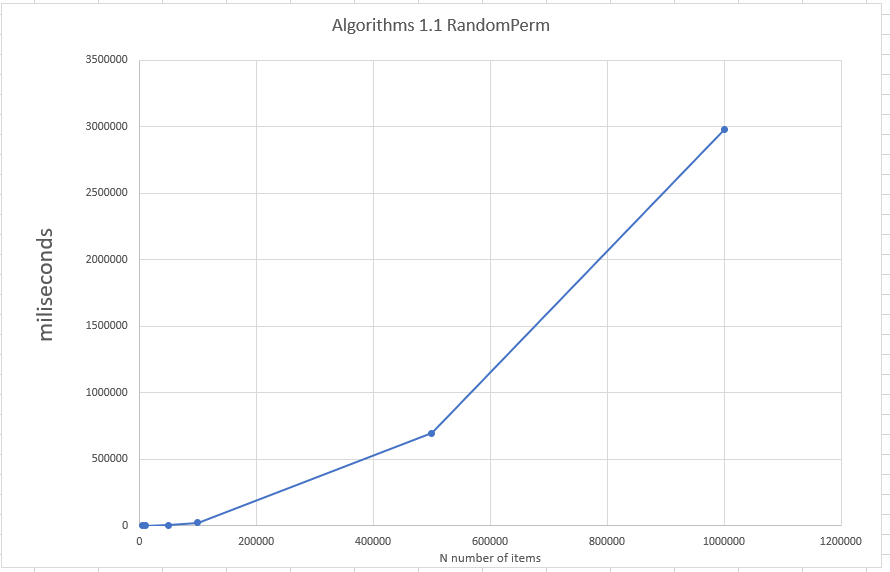
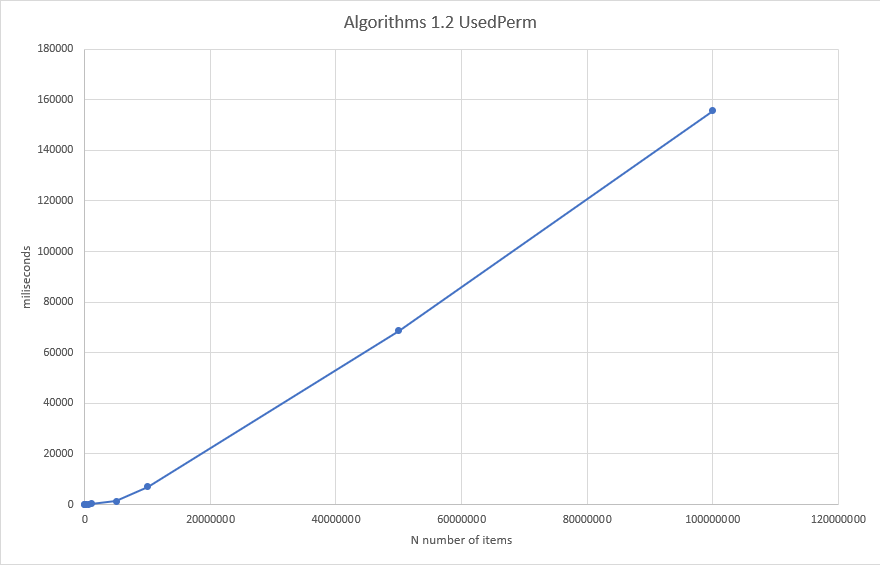
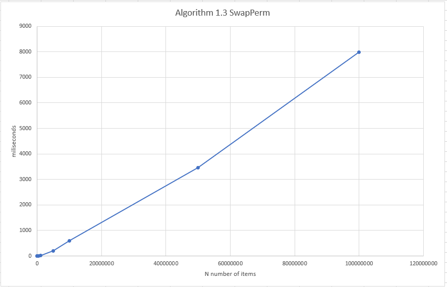

# Complexity & Algorithms assignment 01
In this document we will go over our findings for the 3 given algorithms. The 3 algorithms are: randomPerm, usedPerm, swapPerm.
## Analysis Algorithm 1 ( randomPerm )

During analysis of the randomPerm algorithm we noticed at least 2 for loops and a random part of the algorithm. 
Because we could not quantify how many times the random part was gonna run we initially skipped it as part of our Big O notation. 
Which would make the Big O come out to be O(n2). After discussing this with our teacher (René) we found out that for such a random part of the algorithm it is wise to just add a N for it.
Which would make the Big O come out to be O(n3).

### implementation
Algorithm 1 ( random Perm )
The only really interesting part of the implementation is the while loop. 
Of course the nature of a while loop is that you don't know how many iterations there are gonna be.
The while loop makes sure that the random number we generate is also not already used. 
This is done by setting a flag when we find a random that is not in the existing list.

### achieved results
In figure 0.1 you see the results after running the randomPerm algorithm. 
Mind that the results stop after the 1000000 N. 
 The reason for this is that we stopped the algorithm after that iteration. 
 We believed at that time that with the already achieved results that the algorithm was at least close to O(N^3). 

**figure 0.1:**

please see timing-algorithm01.md for the precise timing results we found. 

## Analysis Algorithm 2 ( usedPerm )

During analysis of the usedPerm algorithm we noticed at least 1 for loop and a random part of the algorithm. 
We know from the analysis of algorithm 1 that the random part of the algorithm is considered to be n iterations,
knowing that can now see that algorithm 2 has a big O notation of O(n2).

### implementation
Algorithm 2 (usedPerm)
The design of the the second algorithm is quite close to the randomPerm algorithm.
However, in this case we have implemented a second array with boolean values for comparison
whether a number was already present in the generated array.
This allowed us to get rid of the nested for loop inside the while loop and make a comparison for validation.
However this algorithm suffers from the same flaw as algorithm one, the unpredictable nature of the while loop,
and the amount of iterations required for finishing the algorithm although we estimated that at worst the algorithm would 
be O(N^2). The best case could be O(N) if the the correct number is pulled at the first while loop iteration each time.
But we deem the chance of this happening highly unlikely so we concluded that the average case generally would be O(N^2).

### achieved results
In figure 0.2 you see the results after running the usedPerm algorithm
We ran this algorithm for the full range of numbers up until 100000000 N.
Overall this algorithm is a lot faster when compared to the randomPerm algorithm.
In comparison the second algorithm only makes use of one for loop and a nested while loop
opposed to randomPerms for loop nested while loop with nested for loop structure.
Instead we keep a secondary array with boolean values which we simply flag to true 
when the element does not exist yet in the array.
We estimate that the running time of algorithm 2 is O(N^2).

**figure 0.2:**

please see timing-algorithm02.md for the precise timing results we found. 

## Analysis Algorithm 3 ( swapPerm )
 
During analysis of the swapPerm algorithm we noticed at least 1 for loop.
Which would make the big O notation O(n). Which is also what we ended up implementing. 
Seeing as this is the smallest Big O notation, 
we also predict that the achieved the lowest results of all the given algorithms.

### implementation
Algorithm 3 (swapPerm)
This algorithm only uses a single for loop to iterate over the array, 
we make use of a temp container to swap the indexes.

### achieved results
In figure 0.3 you see the results after running the swapPerm algorithm.
We ran this algorithm for the full of numbers up until 100000000 N.
As expected this was the fastest algorithm of the three, thanks to the use of a single for loop.
The running time is O(N).
**figure 0.3:**

